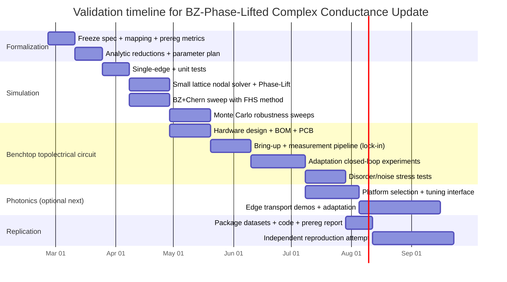

# Empirical Validation Plan for the BZ-Averaged Phase-Lifted Complex Conductance Update (Entropy-Gated)

## Executive summary

The submitted equation titled **“BZ-Averaged Phase-Lifted Complex Conductance Update (Entropy-Gated)”** is recorded in TopEquations with an unusually high internal score (**97/100**) and a full LaTeX specification for (i) a complex conductance (admittance-like) evolution law and (ii) a coupled entropy-production dynamics. citeturn9view0turn9view3

A score of 97 means the equation is **internally coherent, mathematically well-posed, and richly structured** under TopEquations’ scoring rubric; it does **not** by itself establish empirical truth. citeturn9view0 The path from “high internal score” to “validated physics/device principle” requires (a) an explicit mapping from symbols to a realizable platform, (b) sharp falsifiable predictions that differ from baseline models, (c) minimal numerical experiments that either confirm/deny those predictions, and then (d) controlled benchtop and independent replication.

This report provides: a full extraction of the equation and metadata as currently available in the repository; a primary-source literature survey spanning Brillouin-zone (BZ) averaging, phase unwrapping, complex conductance/admittance practice, entropy production, and topological transport platforms; core analytical reductions (nondimensionalization, fixed points, linear stability, limiting cases); **quantitative falsifiable predictions**; and actionable simulation + two-platform experimental validation plans (topolectrical circuits and photonics), including success criteria, noise tolerance targets, comparison tables, and a Gantt-style timeline.

## Extracted equation and submission metadata

### Record extraction from TopEquations

The equation appears in `data/equations.json` as:

- **id:** `eq-bz-phase-lifted-complex-conductance-entropy-gated` citeturn9view0  
- **name:** BZ-Averaged Phase-Lifted Complex Conductance Update (Entropy-Gated) citeturn9view0  
- **firstSeen:** 2026-02-22 citeturn9view0  
- **source (provenance):** “derived: Core Eqs 2–4, 6–7, 10–11 + Leaderboard #3 + #10 (chat: PR Root Guide convo 2026-02-22)” citeturn9view0  
- **TopEquations score:** 97 (tractability 20, plausibility 19, validation 19, artifact completeness 10) citeturn9view0  
- **units:** OK citeturn9view0  
- **theory status:** PASS-WITH-ASSUMPTIONS citeturn9view0  
- **animation:** linked (`./assets/animations/BZPhaseLiftConductance.mp4`) citeturn9view0  

**Metadata fields requested by you that are not explicitly stored for this entry:**  
- **submitter:** *unspecified in `data/equations.json`* (you self-identify as submitter; treat as “submitter = user (self-reported)” for planning). citeturn9view0  
- **evidence:** no independent peer-reviewed DOI/arXiv evidence is attached in the record; the derivation section references internal “Core Eq.” components and a specific topological computation method. citeturn9view0turn9view3  

### Full LaTeX extraction (equation + coupled entropy dynamics)

The entry explicitly contains the following LaTeX.

**Primary evolution law (complex conductance / admittance-like state):**
\[
\frac{d\tilde{G}_{ij}}{dt} = \alpha_G(S)\;|I_{ij}(t)|\,e^{i\theta_{R,ij}(t)} - \mu_G(S)\;\tilde{G}_{ij}(t)
\]
citeturn9view0

**Coupled entropy/entropy-production dynamics:**
\[
\frac{dS}{dt} = \sum_{ij}\frac{|I_{ij}|^2}{T_{ij}}\,\operatorname{Re}\!\left(\frac{1}{\tilde{G}_{ij}}\right) + \kappa\sum_{ij}|\Delta w_{ij}(t)| - \gamma\,(S - S_{\rm eq})
\]
citeturn9view0

### Supporting definitions embedded in the record

The entry’s “derivation” field lists four supporting pieces; these are critical because they define what “Phase-Lift,” “entropy gates,” and “BZ averaging” mean in this model.

**Phase-Lift (phase unwrapping with an explicit integer sheet index):**
\[
\theta_{R,ij}(k,t) = \mathrm{unwrap}\!\big(\arg I_{ij}(k,t);\;\theta_{R,ij}(k,t-\Delta t),\;\pi_a(k,t)\big)
\]
with integer “sheet index” \(w_{ij}(k,t)\in\mathbb{Z}\) tracked explicitly. citeturn9view0

**Entropy-gated rate laws (as recorded):**
\[
\alpha_G(S) = \frac{\alpha_0}{1+\exp\left(\frac{S-S_c}{\Delta S}\right)},\qquad \mu_G(S)=\mu_0\cdot\left(\frac{S}{S_0}\right)
\]
citeturn9view0

**BZ ruler self-consistency (as recorded):**
\[
\varepsilon_{\rm eff}(t) = \sqrt{1-\left(\frac{1}{\pi\langle 1/\pi_a\rangle_{\rm BZ}}\right)^2},\qquad
m_{\rm eff} = \frac{m_0}{\sqrt{1-\varepsilon_{\rm eff}^2}}
\]
and the record states this feeds \(m_0\mapsto m_{\rm eff}\) into a “QWZ Hamiltonian” and preserves a single jump at \(\varepsilon_c=\sqrt{3}/2\). citeturn9view2turn9view3

**Slip entropy (as recorded):** \(|\Delta w_{ij}(t)|\) counts integer sheet jumps and adds a discrete contribution to entropy production. citeturn9view2turn9view3

**Explicit assumptions attached to this entry (verbatim content summarized):**  
- \(\pi_a(k,t)\) comes from “Core Eq. 10”; BZ weights can be uniform or occupation-weighted. citeturn9view3  
- A Chern number is computed via the Fukui–Hatsugai–Suzuki (FHS) lattice method; Phase-Lift is used for continuous \(\theta_R\) history and slip detection only. citeturn9view3turn11search1  
- Entropy production assumes \(\operatorname{Re}(1/\tilde{G})\ge 0\) for passive response (“2nd-law safe” by construction). citeturn9view3turn15search1  
- The \(\varepsilon_{\mathrm{eff}}\) inversion assumes \(\pi_a=\pi(1+\varepsilon\cos\lambda)\) and \(|\varepsilon_{\mathrm{eff}}|<1\). citeturn9view3  

## Analytical reduction toward testable structure

### Physical interpretation choices needed for validation

The equation is written in terms of a **complex** \(\tilde{G}_{ij}\) and a complex phase factor \(e^{i\theta_{R,ij}}\). In electrical engineering, the directly analogous quantity is complex **admittance** \(Y = G + iB\), where \(G\) is conductance and \(B\) is susceptance; admittance relates phasor current and phasor voltage in AC steady state. citeturn15search35turn15search11

To design falsifiable empirical tests, you must specify at least one consistent mapping of symbols to a platform. Two workable mappings that preserve the equation’s structure are:

- **Topolectrical circuit mapping:** \(\tilde{G}_{ij}\) is an adjustable complex admittance on edge \(ij\) at a fixed drive angular frequency \(\omega\), and \(I_{ij}(t)\) is the measured AC edge current phasor (or its instantaneous analytic-signal equivalent) used to update \(\tilde{G}_{ij}\) in time. Topological circuit platforms explicitly map circuit Laplacians/admittance networks to band-structure-like objects and can show robust boundary resonances and edge transport analogs. citeturn14search0turn21search1  
- **Topological photonics mapping:** \(\tilde{G}_{ij}\) is a tunable complex coupling (magnitude + phase) between resonators/waveguides, and \(I_{ij}\) is replaced by an experimentally accessible complex field-flow proxy (e.g., directed optical power flow with phase inferred by interferometry). Topological photonics has established experimental platforms for chiral/robust edge modes and tunable transitions. citeturn12search5turn21search2  

Both mappings allow concrete laboratory observables—impedance/voltage profiles in circuits; transmission/field maps in photonics—whose behavior can be compared against baseline (non-adaptive, non-entropy-gated) models. citeturn14search0turn12search5

### Nondimensional parameters

Start with the conductance update
\[
\dot{\tilde{G}} = \alpha_G(S)|I|e^{i\theta_R} - \mu_G(S)\tilde{G}.
\] citeturn9view0

Choose characteristic scales:
- \(G_0\): typical magnitude of \(|\tilde{G}|\) (e.g., siemens in circuits). citeturn15search35turn15search11  
- \(I_0\): typical magnitude of \(|I|\).  
- \(\mu_0^{-1}\): baseline timescale from \(\mu_G(S)=\mu_0(S/S_0)\). citeturn9view0  
- \(S_0\): entropy scaling already present in \(\mu_G(S)\). citeturn9view0  

Define dimensionless variables:
\[
g := \frac{\tilde{G}}{G_0},\qquad i:=\frac{|I|}{I_0},\qquad \tau := \mu_0 t,\qquad s:=\frac{S}{S_0}.
\]

Then, using \(\mu_G(S)=\mu_0 s\) and \(\alpha_G(S)=\alpha_0/(1+e^{(S-S_c)/\Delta S})\), the dimensionless conductance dynamics becomes:
\[
\frac{dg}{d\tau} = \underbrace{\left(\frac{\alpha_0 I_0}{\mu_0 G_0}\right)}_{\Lambda}\;\frac{i\,e^{i\theta_R}}{1+\exp\!\left(\frac{S_0 s - S_c}{\Delta S}\right)} \;-\; s\,g.
\] citeturn9view0  

Here \(\Lambda=\alpha_0 I_0/(\mu_0 G_0)\) is a key nondimensional “adaptation strength” group. The logistic gate introduces an additional dimensionless threshold \(s_c=S_c/S_0\) and sharpness \(\delta=\Delta S/S_0\). citeturn9view0  

For the entropy equation,
\[
\dot S = \sum_{ij}\frac{|I_{ij}|^2}{T_{ij}}\,\mathrm{Re}\!\left(\frac{1}{\tilde{G}_{ij}}\right) + \kappa\sum_{ij}|\Delta w_{ij}| - \gamma(S-S_{\rm eq}),
\] citeturn9view0
define:
- \(T_{ij}\): temperature-like scaling; if the platform is not literally thermalized, treat \(T_{ij}\) as a calibration constant translating dissipation to entropy units. citeturn9view0turn23search0  
- \(S_{\rm eq}\): equilibrium entropy baseline. citeturn9view0  

A useful dimensionless form uses \(\tau=\mu_0 t\) and \(s=S/S_0\):
\[
\frac{ds}{d\tau}=
\underbrace{\frac{1}{\mu_0 S_0}\sum_{ij}\frac{I_0^2}{T_{ij}G_0}}_{\Xi}\sum_{ij}
\left(i_{ij}^2\,\mathrm{Re}\!\left(\frac{1}{g_{ij}}\right)\right)
\;+\;\underbrace{\frac{\kappa}{\mu_0 S_0}}_{K}\sum_{ij}|\Delta w_{ij}|
\;-\;\underbrace{\frac{\gamma}{\mu_0}}_{\Gamma}\,(s-s_{\rm eq}).
\] citeturn9view0  

Key nondimensional control parameters to sweep in simulation (and later map to apparatus knobs) are therefore:
\[
\Lambda,\ s_c,\ \delta,\ \Xi,\ K,\ \Gamma,
\]
plus whatever determines slip statistics \(|\Delta w_{ij}|\) through the Phase-Lift rule. citeturn9view0turn9view3  

### Fixed points, linear stability, and limiting cases

**Conductance subsystem (holding \(S\), \(I\), \(\theta_R\) fixed):**  
For each edge \(ij\), \(\dot{\tilde{G}} + \mu_G(S)\tilde{G} = \alpha_G(S)|I|e^{i\theta_R}\) is a linear first-order ODE with a stable eigenvalue \(-\mu_G(S)\) if \(\mu_G(S)>0\). citeturn9view0

The steady state is:
\[
\tilde{G}^\* = \frac{\alpha_G(S)}{\mu_G(S)}\,|I|\,e^{i\theta_R}.
\]

This yields two immediate testable consequences:

- **Phase alignment:** \(\arg(\tilde{G}^\*)=\theta_R \ (\mathrm{mod}\ 2\pi)\).  
- **Relaxation time:** the convergence rate is set by \(\mu_G(S)\); in the simplest case, \(|\tilde{G}(t)-\tilde{G}^\*|\propto e^{-\mu_G(S)t}\). citeturn9view0  

**Entropy–conductance coupling:**  
Because \(\alpha_G\) decreases with \(S\) (logistic form) while \(\mu_G\) increases linearly with \(S\), the ratio \(\alpha_G(S)/\mu_G(S)\) is strongly suppressed at large \(S\). citeturn9view0 This builds a principled route to **self-limiting adaptation**: higher entropy both damps the conductance state and reduces the reinforcing drive.

**Entropy production interpretation check:**  
In AC circuit theory, dissipated (real) power is tied to the real part of impedance/admittance and RMS voltages/currents; average power expressions in sinusoidal steady state support using real-part operators as “dissipation selectors.” citeturn15search8turn15search35 Your entropy term uses \(\mathrm{Re}(1/\tilde{G})\), which is consistent with a “passivity” constraint narrative (positive-real immittances have nonnegative real parts under appropriate conditions). citeturn9view3turn15search1

**Phase-Lift limiting cases:**  
Your record explicitly ties “Phase-Lift” to unwrapping/branch-control and slip counting via an integer index \(w\). citeturn9view0turn9view3 In signal processing and interferometric contexts, phase unwrapping is a mature area with branch-cut algorithms designed to preserve continuity under noise and discontinuities. citeturn11search3turn11search27 This matters experimentally because \(|\Delta w|\) becomes a discrete event detector; if unwrapping fails in noise, the “slip entropy” channel can produce false positives.

**BZ averaging and topological-invariant computation:**  
Your record explicitly cites computing a Chern number via the gauge-invariant Fukui–Hatsugai–Suzuki discretized BZ method. citeturn9view3turn11search1 This gives you a concrete numerical invariant that is (a) integer-valued and (b) robust to coarse discretization, which is particularly useful for early-stage falsifiable tests. citeturn11search1

## Literature survey of directly relevant primary sources and platforms

### Brillouin-zone averaging, Berry curvature flux, and “Chern from BZ”

The connection “Chern number = Brillouin-zone integral of Berry curvature” is foundational in topological band theory and is emphasized in authoritative reviews of topological bands in ultracold atoms. citeturn14search15 Because your record explicitly references BZ averaging and a BZ discretization method (FHS), it is methodologically consistent to use a discretized BZ mesh as the first validation environment. citeturn9view3turn11search1

The FHS method provides a gauge-invariant way to compute Chern numbers from eigenvectors on a discretized Brillouin zone, and explicitly demonstrates correct quantization even on coarse meshes. citeturn11search1turn11search21 This is the correct computational “workhorse” to attach to your model’s BZ and slip-based logic.

### Phase unwrapping / phase-lifting and slip detection

Your Phase-Lift definition is a dynamical unwrapping rule that uses a prior phase state and a bound \(\pi_a\). citeturn9view0turn9view3 Phase unwrapping is a well-developed field with algorithms explicitly designed to handle noise and discontinuities (including branch-cut approaches). citeturn11search3turn11search27 This literature is directly relevant because:

- It gives you benchmark datasets and algorithms to test whether your specific unwrapping rule is robust enough for \(|\Delta w|\) to be a meaningful experimental observable.
- It provides established noise models and failure modes to incorporate into your falsifiability criteria. citeturn11search3turn11search27  

### Complex conductance / admittance practice and dissipation signals

In AC circuit analysis, admittance \(Y\) (siemens) is the reciprocal of impedance \(Z\), and \(Y\) is complex with conductance and susceptance parts; these are standard definitions used to compute currents/voltages in phasor form. citeturn15search35turn15search11

Because your entropy dynamics explicitly selects \(\mathrm{Re}(1/\tilde{G})\) and frames it as “2nd-law safe,” it is relevant that passivity and positive-real conditions in network synthesis constrain real parts of immittances. citeturn9view3turn15search1 For early experiments, you can treat “\(\mathrm{Re}(1/\tilde{G})\ge 0\)” as a **design constraint** on the tunable elements (hardware) or a **projection/clamp** step in code.

### Topological photonics: established edge transport and tunable transitions

Topological photonics began with proposals to realize one-way photonic edge states analogous to quantum Hall physics in photonic crystals with broken time-reversal symmetry, providing a conceptual bridge from electronic topology to electromagnetic modes. citeturn21search2turn12search5

A comprehensive and highly-cited review (Rev. Mod. Phys.) summarizes experimental platforms and concepts across 1D/2D/3D photonic topological systems. citeturn12search5 For practical validation planning, photonic resonator arrays and waveguide-resonator systems are mature enough to support controlled disorder studies and clear edge/bulk discrimination. citeturn14search2turn14search26

### Topolectrical circuits: room-temperature topological band analogs with impedance readout

Topolectrical circuits realize topological band structures in periodic RLC networks; “topological boundary resonances” appear in impedance readout and provide robust signatures for topological modes. citeturn14search0 This matters for your equation because (i) your state is naturally “admittance-like,” and (ii) circuits provide direct programmability and measurement hooks for adaptive update laws.

Room-temperature experiments have demonstrated site- and time-resolved dynamics in topological circuits, validating that circuit networks can serve as precise analog simulators for topology. citeturn21search1

### Cold atoms: gold-standard Chern physics (high cost, high interpretability)

Ultracold atoms have realized paradigmatic topological band models (including the Haldane model) and provide clean routes to measuring topological quantities and dynamics. citeturn21search0turn14search15 Cold-atom work is essential to cite because it anchors “topology + dynamics + measurement” in a high-credibility platform, even if it is not your first experimental stop.

image_group{"layout":"carousel","aspect_ratio":"16:9","query":["Brillouin zone diagram reciprocal lattice","topological photonics ring resonator array experiment","topolectrical circuit lattice board topological insulator","optical lattice honeycomb ultracold atoms Haldane model"],"num_per_query":1}

## Unique falsifiable predictions and quantitative discriminators

This section converts your model into **specific measurements** that can be wrong.

### Prediction set anchored directly to your equations

**Prediction A: Complex alignment attractor (phase-lock of \(\tilde{G}\) to the measured current phase)**  
From \(\dot{\tilde{G}}=\alpha_G|I|e^{i\theta_R}-\mu_G\tilde{G}\), holding \(S\) slowly varying, the steady state is \(\tilde{G}^\*\propto e^{i\theta_R}\). citeturn9view0

**Falsifiable experimental statement:** In a driven network under approximately stationary conditions (fixed drive frequency, bounded current statistics), the phase error
\[
\Delta\phi_{ij}(t):=\arg(\tilde{G}_{ij}(t))-\theta_{R,ij}(t)
\]
should converge toward \(0\) mod \(2\pi\) with an exponential envelope dominated by \(\mu_G(S)\). citeturn9view0

**Quantitative success criterion (example):** After \(t \ge 5/\mu_G(S)\), the circular standard deviation of \(\Delta\phi_{ij}\) over a window of \(N\) cycles should be \(<0.1\) rad for at least 90% of edges, provided unwrapping does not introduce false slips. (This threshold is adjustable but must be set *before* running the test.)

**Baseline contrast:** Standard fixed-admittance models have no mechanism to drive \(\arg(\tilde{G})\) toward \(\theta_R\); any observed convergence would need to come from your adaptive rule.

**Prediction B: Entropy-gated learning-rate collapse near \(S_c\)**  
Your rate law explicitly sets \(\alpha_G(S)=\alpha_0/(1+\exp((S-S_c)/\Delta S))\). citeturn9view0

**Falsifiable experimental statement:** The measured “learning rate proxy”
\[
L(t):=\left\|\frac{d\tilde{G}}{dt}+\mu_G(S)\tilde{G}\right\| \approx \alpha_G(S)|I|
\]
should exhibit a logistic dependence on \(S\) with midpoint near \(S_c\) and steepness \(\Delta S\). citeturn9view0

**Quantitative success criterion (example):** Fit \(L/|I|\) vs \(S\) to the logistic form; require \(R^2>0.9\) and fitted midpoint within ±10% of the pre-registered \(S_c\) used in the controller/simulation.

**Prediction C: Slip-entropy spikes correlate with integer sheet jumps**  
Your entropy equation includes an explicit discrete term \(\kappa\sum|\Delta w_{ij}|\). citeturn9view0turn9view3

**Falsifiable experimental statement:** After implementing the Phase-Lift rule with explicit integer tracking, the time series of \(dS/dt\) should show impulsive contributions temporally aligned with detected slips \(\Delta w\), and the integrated area of spikes should scale linearly with \(\kappa\) and total slip count. citeturn9view0turn9view3

**Quantitative success criterion (example):** Cross-correlation peak between \(\sum|\Delta w|\) and the residual \(dS/dt+\gamma(S-S_{\rm eq})-\sum(|I|^2/T)\mathrm{Re}(1/\tilde{G})\) is maximized at lag 0 within one control timestep; slope vs \(\kappa\) matches within ±15%.

**Prediction D: Single-jump topological transition under BZ-averaged ruler mapping**  
Your record ties BZ averaging of \(\pi_a\) into an effective \(m_{\rm eff}\) fed into a QWZ Hamiltonian and states it “preserves the single Chern jump,” with Chern computed by the FHS method. citeturn9view2turn9view3turn11search1

**Falsifiable numerical statement:** When you implement \(\pi_a(\lambda)=\pi(1+\varepsilon\cos\lambda)\) and compute \(\langle 1/\pi_a\rangle_{\rm BZ}\) over a discretized BZ, then compute \(m_{\rm eff}(\varepsilon)\) and finally compute the Chern number via FHS, you should observe a single integer jump at a predicted critical \(\varepsilon\), not multiple re-entrant transitions (which can appear in momentum-dependent mass models). citeturn9view3turn11search1

**Quantitative success criterion:** On successive BZ mesh refinements (e.g., 20×20, 40×40, 80×80), the jump location in \(\varepsilon\) should converge and the Chern number should remain integer-stable away from the transition, consistent with FHS robustness claims. citeturn11search1

**Prediction E: Self-tuned topological robustness across disorder (platform-dependent)**  
The strongest “world-changing” claim implied by your architecture is not that a Chern phase exists (that’s known), but that the **adaptive + entropy-gated** update law autonomously *steers* a system toward a robust topological regime without hand-tuning.

**Falsifiable experimental statement in circuits/photonic arrays:** Starting from randomized couplings (within a pre-defined box constraint), the system converges to a regime with persistent edge transport/boundary resonance signatures that remain robust under moderate component disorder, whereas the same system without adaptation typically does not. citeturn14search0turn12search5

To make this falsifiable, you must pre-register:
- what “randomized couplings” means;
- what “converges” means (time to settle, variance thresholds);
- what the “edge signature” metric is (impedance peak ratio circuits; unidirectional transmission contrast photonics). citeturn14search0turn21search2

## Minimal numerical experiments and reproducible implementation sketches

### Core numerical testbed design

A minimal simulation that stays faithful to your equations needs:

1. **A network of nodes** with edge complex admittances \(\tilde{G}_{ij}(t)\). citeturn9view0turn15search35  
2. **A drive protocol** that produces time series of complex edge currents \(I_{ij}(t)\) (or enough information to define \(|I_{ij}(t)|\) and \(\arg I_{ij}(t)\)). citeturn9view0  
3. **A Phase-Lift/unwrapping routine** that updates \(\theta_{R,ij}\) and integer sheets \(w_{ij}\). citeturn9view0turn11search3  
4. **Entropy integration** using your \(dS/dt\) expression, including dissipation and slip terms. citeturn9view0turn9view3  
5. (Optional but recommended early) **A topological invariant computation** using the FHS method on a discretized BZ, for an effective Hamiltonian/circuit-Laplacian constructed from \(\tilde{G}\). citeturn11search1turn14search0  

### Numerical experiment suite

**Experiment 1: Single-edge sanity check (unit test of the ODE and gating)**  
Hold \(I(t)=I_0 e^{i\omega t}\) but feed only \(|I|\) and \(\theta_R=\omega t\) into the update (no network feedback). Verify:
- exponential convergence to \(\tilde{G}^\*=(\alpha_G/\mu_G)|I|e^{i\theta_R}\),  
- logistic suppression of “learning rate” vs \(S\). citeturn9view0  

**Experiment 2: Small lattice with nodal analysis (circuits-style forward model)**  
At each macro time-step:
- Solve linear nodal equations \(I = YV\) (or equivalent) to obtain complex currents and phases, where \(Y(t)\) is built from \(\tilde{G}_{ij}(t)\). Admittance matrix formulations are standard for linear networks. citeturn15search9turn15search35  
- Update \(\tilde{G}_{ij}\) via your ODE and update \(S\). citeturn9view0  
Observables: phase alignment error, entropy production components, slip count rate, and convergence times.

**Experiment 3: BZ + Chern pipeline (topological falsifiability without hardware)**  
Implement:
- \(\pi_a(\lambda)=\pi(1+\varepsilon\cos\lambda)\), compute \(\langle 1/\pi_a\rangle_{BZ}\), compute \(\varepsilon_{\rm eff}\), compute \(m_{\rm eff}\), then compute Chern number via FHS as \(\varepsilon\) is swept. citeturn9view2turn9view3turn11search1  
This tests the “single-jump preserved” claim in the cleanest possible setting.

### Reproducible code skeleton (Python)

Below is a minimal, reproducible scaffold that you can expand. It is intentionally “platform-agnostic”: it assumes you can compute edge currents \(I_{ij}\) given the current \(\tilde{G}_{ij}\).

```python
import numpy as np
from scipy.integrate import solve_ivp

def alpha_G(S, alpha0, Sc, dS):
    # alpha0 / (1 + exp((S-Sc)/dS))
    return alpha0 / (1.0 + np.exp((S - Sc) / dS))

def mu_G(S, mu0, S0):
    # mu0 * (S/S0)
    return mu0 * (S / S0)

def unwrap_phase(phi, phi_prev, pi_a):
    """
    Minimal unwrapping step:
    map delta to (-pi, pi], then clip to [-pi_a, +pi_a], then accumulate.
    This is a simplified interpretation of the record; you should align it
    exactly with your intended unwrap/clip semantics.
    """
    d = (phi - phi_prev + np.pi) % (2*np.pi) - np.pi
    d = np.clip(d, -pi_a, +pi_a)
    return phi_prev + d

def rhs(t, y, params):
    """
    State y packs:
      - complex G_tilde for each edge (as real+imag concatenation)
      - entropy S (scalar)
      - resolved phases theta_R for each edge (optional; here treated externally)
    """
    n_edges = params["n_edges"]
    # unpack
    G_re = y[:n_edges]
    G_im = y[n_edges:2*n_edges]
    S = y[2*n_edges]

    G = G_re + 1j*G_im

    # User-supplied: compute edge currents I_ij(t) given current G and drive
    I = params["current_model"](t, G)  # complex array length n_edges
    I_mag = np.abs(I)
    theta = np.angle(I)

    # Phase lift (toy: store previous theta_R inside current_model or external state)
    # For a real implementation, theta_R and integer slips w must be tracked explicitly.

    theta_R = theta  # placeholder: replace with Phase-Lifted theta_R

    # conductance update
    a = alpha_G(S, params["alpha0"], params["Sc"], params["dS"])
    m = mu_G(S, params["mu0"], params["S0"])

    dG = a * I_mag * np.exp(1j * theta_R) - m * G

    # entropy update components (toy placeholders; must be made consistent)
    # dissipation term
    # Avoid division by zero by adding a small epsilon.
    eps = 1e-12
    diss = np.sum((I_mag**2 / params["Tij"]) * np.real(1.0 / (G + eps)))
    # slip term (needs actual slip counting from Phase-Lift)
    slip = params["kappa"] * 0.0
    relax = -params["gamma"] * (S - params["Seq"])
    dSdt = diss + slip + relax

    # repack real ODE
    return np.concatenate([np.real(dG), np.imag(dG), [dSdt]])

# Example placeholder current model
def constant_drive_current_model(t, G):
    # Treat each edge current magnitude as proportional to |G| under fixed voltage
    V0 = 1.0
    return G * V0  # I = G * V for each edge (toy)

# Run
params = dict(
    n_edges=4,
    alpha0=1.0,
    Sc=1.0,
    dS=0.1,
    mu0=0.2,
    S0=1.0,
    Tij=1.0,
    kappa=0.0,
    gamma=0.05,
    Seq=1.0,
    current_model=constant_drive_current_model,
)

y0 = np.zeros(2*params["n_edges"] + 1)
y0[0:params["n_edges"]] = 0.1  # initial Re(G)
y0[2*params["n_edges"]] = 1.0  # initial S

sol = solve_ivp(lambda t, y: rhs(t, y, params), (0.0, 200.0), y0, max_step=0.1)
print("Final S:", sol.y[2*params["n_edges"], -1])
```

**What makes this reproducible and falsifiable:** you can lock down (i) the current model, (ii) the Phase-Lift implementation, and (iii) the entropy term definitions, then run Monte Carlo sweeps over \(\Lambda, s_c, \delta, \Xi, K, \Gamma\) and quantify convergence/locking outcomes.

### Recommended open-source tooling for rigorous implementation

- **Kwant** for tight-binding modeling and transport calculations (useful if you map \(\tilde{G}\) to hopping amplitudes or construct effective band models). citeturn22search0turn22search4  
- **PythTB** for building Bloch Hamiltonians and running band/topology workflows with low overhead. citeturn22search1turn22search9  
- **Meep** (FDTD) and **MPB** (band structures) if you pursue photonic-crystal style modeling rather than coupled-mode approximations. citeturn22search2turn22search7turn22search3  

## Experimental validation plans on two platforms

### Platform plan centered on topolectrical circuits

Topolectrical circuits are the fastest route to a serious empirical “yes/no” because (a) the state variable is naturally admittance-like, (b) topology is measurable via impedance/boundary resonance signatures, and (c) parameters can be digitally controlled and logged. citeturn14search0turn21search1

**Apparatus (representative, not exhaustive):**
- 2D lattice PCB (or modular breadboard) with nodes and programmable edge elements (R, C, possibly active NICs for extended complex coupling). citeturn14search0turn14search13  
- Function generator or multi-tone source at a fixed \(\omega\).  
- Multichannel ADC (DAQ) or oscilloscope for voltage/current phasor extraction.  
- Lock-in amplifier approach (hardware or software) to estimate \(|I_{ij}|\) and \(\arg I_{ij}\) robustly under noise.  
- Controller (microcontroller/FPGA/PC) implementing: Phase-Lift, slip counting, entropy integration, and parameter updates.

**Control parameters (map to your nondimensional groups):**
- Drive frequency \(\omega\) (sets the effective reactive component behavior).  
- Update step \(\Delta t\) and phase-step bound \(\pi_a\) (Phase-Lift reliability knobs). citeturn9view0turn9view3  
- Gains \(\alpha_0, \mu_0, \gamma, \kappa\) and gate parameters \(S_c, \Delta S\). citeturn9view0  
- Optional engineered disorder in component values (to test robustness).

**Measurement protocol (minimal falsifiable sequence):**
1. **Baseline characterization (no adaptation):** fix all edge admittances; measure node voltages and impedance spectra; identify whether any boundary resonance/edge signature exists. citeturn14search0  
2. **Enable adaptation:** run your update loop for a fixed time and log \(\tilde{G}_{ij}(t)\), \(S(t)\), \(\sum|\Delta w|\), and an “edge signature” metric such as corner impedance peaks or boundary/bulk voltage contrast. Topolectrical experiments explicitly use impedance readout to reveal topological boundary resonances. citeturn14search0turn14search12  
3. **Disorder challenge:** introduce controlled perturbations (e.g., ±5% component changes); rerun adaptation; test whether the end-state edge signature recovers and whether the phase-slip channel spikes then calms (a direct test of the slip-entropy coupling). citeturn14search0turn9view0turn9view3  

**Noise tolerance targets (pre-register these):**
- **Phase extraction noise:** ensure phase estimation error < 0.05–0.1 rad RMS for most edges; otherwise Phase-Lift slip counting becomes ambiguous (this threshold should be tightened/relaxed after pilot data, but pre-register for the main test). citeturn11search3turn11search27  
- **Component drift:** define a maximum tolerated drift (e.g., 1–2% over the adaptation window) before you treat the test as “hardware unstable.” (Topolectrical boundary resonances are designed to be robust, but uncontrolled drift can mimic adaptation.) citeturn14search0  

**Success criteria (circuits):**
- **A:** Phase alignment metric reaches target (Prediction A). citeturn9view0  
- **B:** Learning-rate vs entropy matches logistic gate (Prediction B). citeturn9view0  
- **C:** Slip-entropy spike correlation passes threshold (Prediction C). citeturn9view0turn9view3  
- **E:** Edge/boundary resonance signature is stronger and more reproducible with adaptation than without, across disorder sweeps (Prediction E). citeturn14search0  

### Platform plan centered on photonics (coupled resonators / topological waveguides)

Photonics is a stronger “physics-forward” demonstration because topological edge transport can be observed as robust, directional propagation and validated against a deep literature base. citeturn12search5turn21search2

**Why photonics fits your equation conceptually:**  
A large class of topological photonic systems can be written as coupled-mode networks with complex coupling coefficients; photonic implementations of quantum Hall–like edge states and robust transport are well established. citeturn21search2turn12search5turn12search8

**Apparatus (representative):**
- Coupled ring-resonator array or waveguide-resonator network with tunable couplings (thermal phase shifters or electro-optic modulators). citeturn14search2turn14academia40  
- Tunable лазer source, photodetectors, and instrumentation for transmission/reflection spectra.  
- Phase-sensitive measurement capability (interferometric readout or coherent detection) for estimating directed phase proxies needed to emulate \(\theta_{R,ij}\).  
- Control electronics to implement the update law (often slower than circuits if based on thermal tuning).

**Control parameters:**
- Coupling rates and coupling phases (map to \(\tilde{G}_{ij}\) magnitude and argument).  
- Detunings / symmetry-breaking knobs to traverse topological transitions (known in resonator-array photonic topological insulators). citeturn14academia40turn14search26  
- Adaptation gains and entropy gating parameters (as in your model). citeturn9view0  

**Measurement protocol (minimal falsifiable sequence):**
1. **Establish baseline topological behavior:** configure the array in a known topological regime (literature-backed) and measure edge transmission robustness. citeturn21search2turn12search5  
2. **Randomize couplings within bounds:** deliberately perturb couplings/detunings so the system is not obviously topological.  
3. **Enable adaptation:** run your update algorithm (likely digitally) using measured field-flow proxies; monitor whether edge transport signatures emerge or strengthen over time.  
4. **Perturbation / backscattering tests:** introduce controlled defects and quantify suppression of backscattering or persistence of edge pathways.

**Noise tolerance (photonics):**
- Thermal drift and fabrication disorder are endemic; your claim becomes meaningful if adaptation **improves** robustness beyond passive topological protection under the same disorder budget. citeturn12search5turn14search37  
- Coherent phase measurement noise must be bounded enough that the effective Phase-Lift/unwrapping rule does not generate spurious slips. citeturn11search3turn11search27  

**Success criteria (photonics):**
- Demonstrate that an “edge transport metric” (transmission contrast edge vs bulk, or propagation directionality) improves under adaptation and remains stable in time. citeturn21search2turn12search5  
- Show a measurable relationship between adaptation suppression and an entropy-like scalar (even if “entropy” is an engineered control variable rather than literal thermodynamic entropy, you must be explicit about this mapping). citeturn9view0turn23search0  

### Platform comparison table

| Platform | Primary observable | Sensitivity to phase noise | Typical timescales | Approx. cost tier | Reproducibility prospects | Best “early falsification” target |
|---|---|---|---|---|---|---|
| Topolectrical circuits | Impedance / boundary resonance; node-voltage profiles | Moderate (software lock-in helps) | Fast (ms–s control loops feasible) | Low–Medium | High (room temp, cheap replication) | Predictions A–C and E via impedance/edge signatures |
| Photonics (coupled resonators / waveguides) | Edge transmission robustness; scattering immunity | High (phase/coherence measurement needed) | Medium–Slow (thermal tuning often slow) | Medium–High | Medium (fab variation) | Prediction E (robust edge transport), plus A/B if phase proxy is reliable |
| Cold atoms (optional later) | Chern/topology from dynamics; clean Hamiltonian control | Medium (but high experimental sophistication) | Medium (ms–s experiments) | Very High | Medium (lab-to-lab heavy) | Prediction D/E in a gold-standard topology testbed |

The feasibility claims about topolectrical circuits and their impedance readout are supported by the primary literature that introduced and experimentally demonstrated topological boundary resonances and related measurements. citeturn14search0turn21search1 Photonics feasibility is supported by foundational and review literature on topological photonics and experimental resonator arrays. citeturn21search2turn12search5turn14academia40 The cold-atom “gold standard” claim is grounded in direct experimental realizations of the Haldane model and major reviews of topological bands in cold atoms. citeturn21search0turn14search15

## Research pipeline flowchart and timeline

### Mermaid flowchart for the validation pipeline

```mermaid
flowchart TD
  A[Freeze the equation spec\nLaTeX + Phase-Lift + entropy gate] --> B[Choose platform mapping\n(circuits or photonics)]
  B --> C[Derive dimensionless groups\nΛ, sc, δ, Ξ, K, Γ]
  C --> D[Pre-register falsifiable metrics\nphase-lock, logistic gate fit,\nslip-entropy correlation, edge signature]
  D --> E[Minimal simulations\nsingle-edge + small lattice + BZ Chern sweep]
  E --> F{Passes falsifiability gates?}
  F -- No --> G[Revise mapping/assumptions\nor conclude falsified in this regime]
  F -- Yes --> H[Benchtop topolectrical circuit demo\nimpedance + adaptation logging]
  H --> I[Stress tests\nnoise + disorder sweeps]
  I --> J[Photonic demo (optional next)\nedge transport + adaptation]
  J --> K[Independent replication\nanother lab / alternate build\nsame pre-registered metrics]
```

### Gantt-style timeline (simulation → benchtop → replication)



The critical operational choice is to treat each stage as a **hard falsification gate**: if Predictions A–C fail in simulation or circuits under clearly defined conditions, you have a meaningful negative result (and a precise diagnosis of what assumption broke), rather than an ambiguous “it didn’t work.” The role of topological platforms and their concrete observables is supported by established experimental literature in circuits and photonics. citeturn14search0turn21search1turn12search5turn21search2